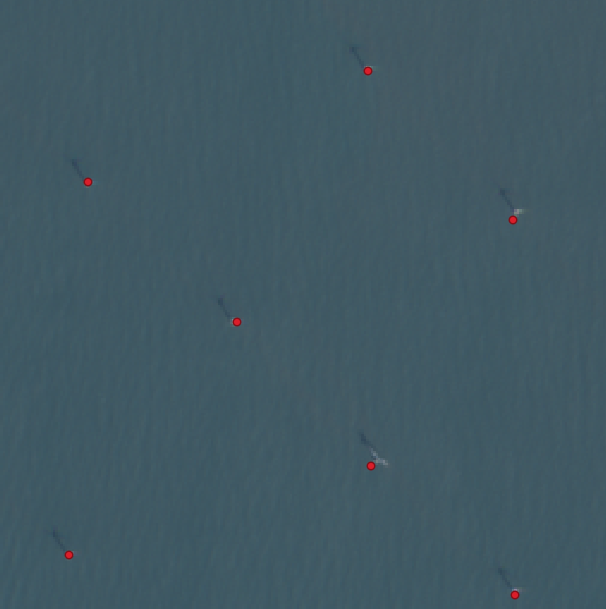

Example: Windows from GeoJSON
-----------------------------

In this example, we will create windows that contain point features in a GeoJSON file.
We will then acquire Sentinel-2 images in those windows, and train a model to predict
the points, using a bounding box object detection head.

We used this GeoJSON of marine infrastructure while creating this example, but you
should be able to substitute any GeoJSON (although model performance will vary):

https://pub-956f3eb0f5974f37b9228e0a62f449bf.r2.dev/outputs/marine/latest.geojson

### Add Windows

We will start by creating a new dataset: create a directory `/path/to/dataset` and
create the dataset configuration file at `/path/to/dataset/config.json` as follows:

```json
{
    "layers": {
        "sentinel2": {
            "type": "raster",
            "band_sets": [{
                "dtype": "uint8",
                "bands": ["R", "G", "B"]
            }],
            "data_source": {
                "name": "rslearn.data_sources.gcp_public_data.Sentinel2",
                "index_cache_dir": "cache/sentinel2/",
                "sort_by": "cloud_cover",
                "use_rtree_index": false
            }
        }
    }
}
```

Download the GeoJSON data to a subfolder within the dataset directory:

```
export DATASET_PATH=/path/to/dataset
mkdir -p $DATASET_PATH/source_data/all/
mkdir -p $DATASET_PATH/source_data/subset/
wget https://pub-956f3eb0f5974f37b9228e0a62f449bf.r2.dev/outputs/marine/latest.geojson -O $DATASET_PATH/source_data/all/latest.geojson
```

We sampled 100 features to use, but you can try using the full GeoJSON if you like.

```python
import json
import os
import random
ds_path = os.environ["DATASET_PATH"]
with open(os.path.join(ds_path, "source_data/all/latest.geojson")) as f:
    feature_collection = json.load(f)
feature_collection["features"] = random.sample(feature_collection["features"], 100)
with open(os.path.join(ds_path, "source_data/subset/latest.geojson"), "w") as f:
    json.dump(feature_collection, f)
```

Now we can use the `dataset add_windows` command to create the windows.

```
rslearn dataset add_windows --group default --fname $DATASET_PATH/source_data/subset/latest.geojson --grid_size 256 --utm --resolution 10 --start 2024-01-01T00:00:00+00:00 --end 2024-07-01T00:00:00+00:00 --root dataset/
```

Here, we create windows along a 256x256 grid by passing `--grid_size 256`; windows are
created at each grid cell that intersects at least one GeoJSON feature. We could
instead pass `--window_size 256` to create 256x256 windows centered at each GeoJSON
feature, but since we will be using the features as labels (and we won't use random
cropping in this example) that would allow the model to learn that there is always a
label at the center of each image.

We use `--utm` to create the windows in UTM projection, and `--resolution 10` to make
the windows 10 m/pixel so they match the Sentinel-2 resolution.

Use rslearn to retrieve the Sentinel-2 images:

```
rslearn dataset prepare --root $DATASET_PATH --workers 32
rslearn dataset ingest --root $DATASET_PATH --workers 8 --no-use-initial-job --jobs-per-process 1
rslearn dataset materialize --root $DATASET_PATH --workers 8 --no-use-initial-job
```

### Add Labels

We now use the
[LocalFiles data source](../DatasetConfig.md#rslearndata_sourceslocal_fileslocalfiles)
to incorporate the points as an additional vector layer in our dataset.

Add a new layer to the dataset configuration file:

```json
{
    "layers": {
        "sentinel2": { ... },
        "label": {
            "type": "vector",
            "format": {
                "name": "geojson",
                "coordinate_mode": "crs"
            },
            "data_source": {
                "name": "rslearn.data_sources.local_files.LocalFiles",
                "src_dir": "source_data/all/"
            }
        }
    }
}
```

Here, we reference the entire dataset rather than the subset because there may be
points that we didn't sample that still intersect with the windows we created.

Note: if your GeoJSON is not inside the dataset path, then use an absolute path
prefixed with "file://" for the `src_dir`. The `src_dir` must be the directory
containing the GeoJSON, and it should not contain other files.

Run prepare, ingest, and materialize again to get the labels:

```
rslearn dataset prepare --root $DATASET_PATH --disabled-layers sentinel2 --workers 32
rslearn dataset ingest --root $DATASET_PATH --disabled-layers sentinel2 --workers 8 --no-use-initial-job --jobs-per-process 1
rslearn dataset materialize --root $DATASET_PATH --disabled-layers sentinel2 --workers 8 --no-use-initial-job
```

You should be able to view the resulting cropped GeoJSON labels alongside the
Sentinel-2 images using qgis.



### Train Model

TODO
