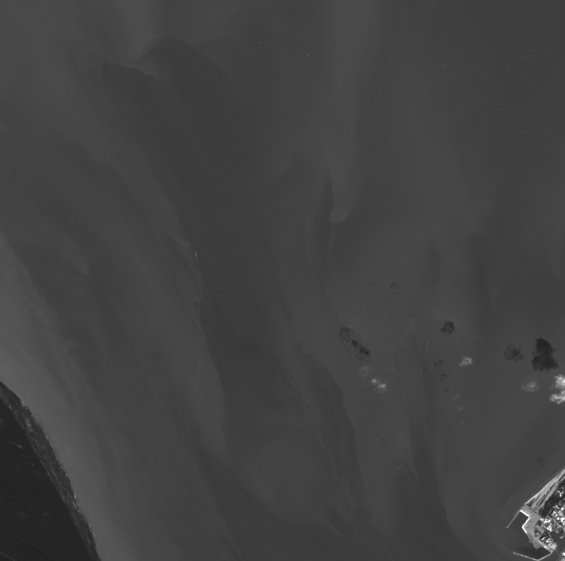
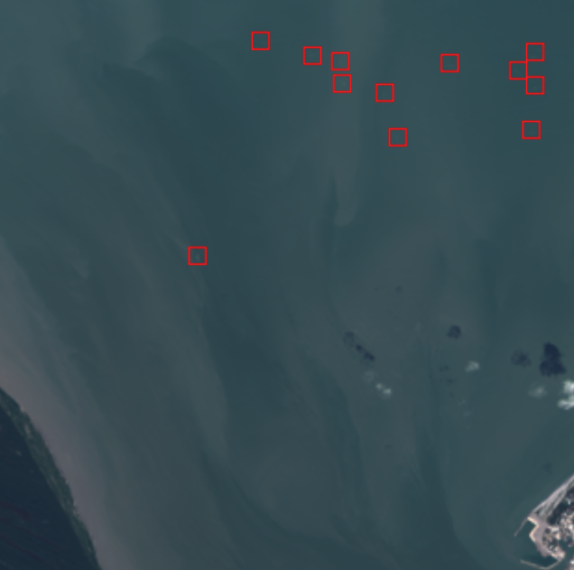

# Model Summary

## Overview
- **Model Name**: Landsat Vessel Detection
- **Model Version**: `v0.0.1`
- **Tag**: `landsat_vessels_v0.0.1`
- **Last Updated**: `2024-11-25`

---

## Offline Evaluation Metrics

Note: The evaluation metrics are reported for the two-stage model (detector + classifier), without any filters.

| Date       | Version | Precision | Recall | F1-Score |
|------------|---------|-----------|--------|----------|
| 2024-11-15 | 0.0.1   | 0.72      | 0.53   | 0.61     |
| YYYY-MM-DD | TBD     | TBD       | TBD    | TBD      |

## Offline Scenario Checks

| Mode                                  | Status  |
|---------------------------------------|---------|
| **True Positive** - Dense vessels     | ✅ Pass |
| **True Positive** - Sparse vessels    | ✅ Pass |
| **False Positive** - Icebergs         | ✅ Pass |
| **False Positive** - Clouds           | ✅ Pass |
| **False Positive** - Whitecaps        | ✅ Pass |

---

## Model Configurations
- **Detector**: `rslearn_projects/data/landsat_vessels/config_detector.yaml`
- **Classifier**: `rslearn_projects/data/landsat_vessels/config_classifier.yaml`
- **Filters**: marine infrastructure `rslearn_projects/rslp/utils/filter.py`

---

## Known Issues & Next Steps

1. **Missed Small Vessels**: The recall is not high because the model missed a lot of very small vessels.

Below is an example of the missed vessels, a lot of them are only visible in the B8 band (with 15m resolution) and are not visible in the RGB image (with 30m resolution):

    
    

*Possible solutions: (1) Add positive samples from the detector training set into the classifier training set.*

2. **False Positive**: Though the model now is more robust to false positives, it still sometimes misclassifies objects like whitecaps, islands as vessels.

*Possible solutions: (1) Add more negative samples into the classifier training set. (2) Add high-resolution distance-to-coastline filter to remove detections that are too close to the coastline.*

---

## Changelog
- **`v0.0.1`**: Initial model release. Offline evaluation metrics reported.
