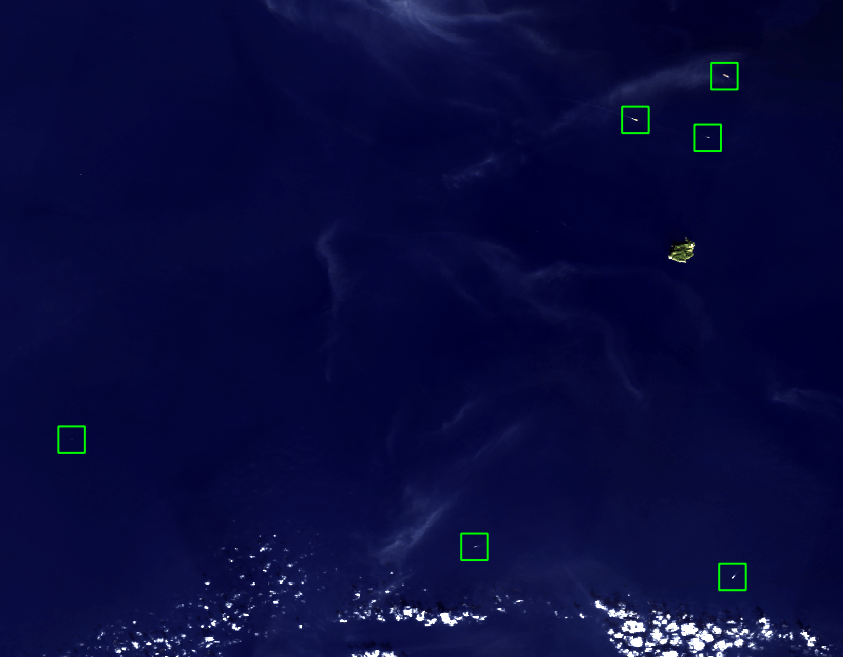

Landsat Vessel Detection
---------------------------

The Landsat vessel detection model detects ships in Landsat 8/9 scenes. We use Level-1 data since they are released with a lower latency, and latency is
important for [Skylight](https://www.skylight.global/) (which is the primary use of
this model within Ai2).

The model includes of a detector and a classifier: the detector detects ship-like objects, and the classifier refines these detections by pruning ones that it is confident are not ships. The detector is trained on a dataset consisting of 7,954 Landsat patches (ranging from 384x384 to 768x768) with 18,509 ship labels. The classifier is trained on a dataset consisting of 1,733 annotated detections, with each detection represented as a 64x64 patch centered at the position of a detected ship. See our paper for more details about the model and dataset.

<div style="text-align: center;">
    
</div>


Inference
---------

First, download the detector and classifier checkpoints to the `RSLP_PREFIX` directory.

    cd rslearn_projects
    mkdir -p project_data/projects/landsat_vessels/data_20240924_model_20240924_imagenet_patch512_flip_03/checkpoints/
    wget https://storage.googleapis.com/ai2-rslearn-projects-data/landsat_vessels/detector/best.ckpt -O project_data/projects/landsat_vessels/data_20240924_model_20240924_imagenet_patch512_flip_03/checkpoints/last.ckpt

    mkdir -p project_data/projects/rslearn-landsat-recheck/phase123_20240919_01_copy/checkpoints/
    wget https://storage.googleapis.com/ai2-rslearn-projects-data/landsat_vessels/classifer/best.ckpt -O project_data/projects/rslearn-landsat-recheck/phase123_20240919_01_copy/checkpoints/last.ckpt

The easiest way to apply the model is using the prediction pipeline in `rslp/landsat_vessels/predict_pipeline.py`. You can download the Landsat scene files, e.g. from USGS EarthExplorer or AWS, and then create a configuration file for the prediction pipeline, here is an example:

```json
{
    "image_files": {
    "B2": "/home/data/LC08_L1TP_125059_20240727_20240801_02_T1_B2.TIF",
    "B3": "/home/data/LC08_L1TP_125059_20240727_20240801_02_T1_B3.TIF",
    "B4": "/home/data/LC08_L1TP_125059_20240727_20240801_02_T1_B4.TIF",
    "B5": "/home/data/LC08_L1TP_125059_20240727_20240801_02_T1_B5.TIF",
    "B6": "/home/data/LC08_L1TP_125059_20240727_20240801_02_T1_B6.TIF",
    "B7": "/home/data/LC08_L1TP_125059_20240727_20240801_02_T1_B7.TIF",
    "B8": "/home/data/LC08_L1TP_125059_20240727_20240801_02_T1_B8.TIF",
    },
    "scratch_path": "/home/data/scratch/",
    "json_path": "/home/data/vessels.json",
    "crop_path": "/home/data/crops/"
}
```

This specifies the arguments to
`rslp.landsat_vessels.predict_pipeline.predict_pipeline` via `jsonargparse`.

Now we can run the pipeline:

    python -m rslp.main landsat_vessels predict --config /path/to/config.json

Here, `scratch_path` saves the rslearn dataset, `crop_path` saves the cropped RGB images centered around the detected ships, and `json_path` saves the JSON output of the detected ships, all of which are optional, depending on whether the user wants to save the intermediate results or not.

The prediction pipeline also accepts a Landsat scene ID and automatically downloads the scene images from [AWS](https://aws.amazon.com/marketplace/pp/prodview-ivr4jeq6flk7u#resources). You will need to set up your AWS account for accessing Landsat data. Use the command below to run the pipeline with scene ID:

    python -m rslp.main landsat_vessels predict --scene_id LC08_L1TP_125059_20240727_20240801_02_T1


Training
--------

First, download the training dataset for detector:

    cd rslearn_projects
    mkdir -p project_data/datasets/landsat_vessels/
    wget https://storage.googleapis.com/ai2-rslearn-projects-data/landsat_vessels/landsat_vessels_detector.tar -0 project_data/datasets/landsat_vessels_detector.tar
    tar xvf project_data/datasets/landsat_vessels_detector.tar --directory project_data/datasets/landsat_vessels/

It is an rslearn dataset consisting of window folders like `windows/labels_utm/41984_2354176_f7c057a567ee40b694d0a77ea59ef81a_6359/`. Inside each window folder:

- `layers/landsat/` contains different Landsat bands used by the model.
- `layers/label/data.geojson` contains the positions of ships. These are offset from
  the bounds of the window which are in `metadata.json`, so subtract the window's
  bounds to get pixel coordinates relative to the image.

Use the command below to train the detector. Note that Weights & Biases is needed. You can
disable W&B with `--no_log true` but then it may be difficult to track the metrics.

    python -m rslp.rslearn_main model fit --config data/landsat_vessels/config_detector.yaml --data.init_args.path project_data/datasets/landsat_vessels/dataset_20240924/

Second, download the training dataset for classifier:

    wget https://storage.googleapis.com/ai2-rslearn-projects-data/landsat_vessels/landsat_vessels_classifier.tar -0 project_data/datasets/landsat_vessels_classifier.tar
    tar xvf project_data/dataset/landsat_vessels_classifier.tar --directory project_data/datasets/landsat_vessels/

Use the command below to train the classifier.

    python -m rslp.rslearn_main model fit --config data/landsat_vessels/config_classifier.yaml --data.init_args.path project_data/datasets/landsat_vessels/dataset_20240905/
