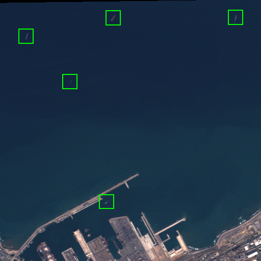

Sentinel-2 Vessel Detection
---------------------------

The Sentinel-2 vessel detection model detects ships in Sentinel-2 L1C scenes. We use
L1C instead of L2A since L1C scenes are released with a lower latency, and latency is
important for [Skylight](https://www.skylight.global/) (which is the primary use of
this model within Ai2).

It is trained on a dataset consisting of 43,443 image patches (ranging from 300x300 to
1000x1000) with 37,145 ship labels. See [our paper](https://arxiv.org/pdf/2312.03207)
for more details about the model and dataset.

Inference
---------

First, download the model checkpoint to the `RSLP_PREFIX` directory.

    cd rslearn_projects
    mkdir -p project_data/projects/sentinel2_vessels/data_20240927_satlaspretrain_patch512_00/checkpoints/
    wget https://storage.googleapis.com/ai2-rslearn-projects-data/sentinel2_vessels/best.ckpt -O project_data/projects/sentinel2_vessels/data_20240927_satlaspretrain_patch512_00/checkpoints/last.ckpt

The easiest way to apply the model is using the prediction pipeline in
`rslp/sentinel2_vessels/predict_pipeline.py`. It accepts a Sentinel-2 scene ID and
automatically downloads the scene images from a
[public Google Cloud Storage bucket](https://cloud.google.com/storage/docs/public-datasets/sentinel-2).

    mkdir output_crops
    mkdir scratch_dir
    python -m rslp.main sentinel2_vessels predict '["scene_id": "S2A_MSIL1C_20180904T110621_N0206_R137_T30UYD_20180904T133425", "json_path": "out.json", "crop_path": "output_crops/"]' scratch_dir/

Then, `out.json` will contain a JSON list of detected ships while `output_crops` will
contain corresponding crops centered around those ships (showing the RGB B4/B3/B2
bands).

Training
--------

First, download the training dataset:

    cd rslearn_projects
    mkdir -p project_data/datasets/sentinel2_vessels/
    wget https://storage.googleapis.com/ai2-rslearn-projects-data/sentinel2_vessels/sentinel2_vessels.tar -O project_data/datasets/sentinel2_vessels.tar
    tar xvf project_data/datasets/sentinel2_vessels.tar --directory project_data/datasets/sentinel2_vessels/

It is an rslearn dataset consisting of window folders like
`windows/sargassum_train/1186117_1897173_158907/`. Inside each window folder:

- `layers/sentinel2/` contains different Sentinel-2 bands used by the model, such as
  `layers/sentinel2/R_G_B/image.png`.
- `layers/label/data.geojson` contains the positions of ships. These are offset from
  the bounds of the window which are in `metadata.json`, so subtract the window's
  bounds to get pixel coordinates relative to the image.

Use the command below to train the model. Note that Weights & Biases is needed. You can
disable W&B with `--no_log true` but then it may be difficult to track the metrics.

    python -m rslp.rslearn_main model fit --config data/sentinel2_vessels/config.yaml --data.init_args.path project_data/datasets/sentinel2_vessels/

To visualize outputs on the validation set:

    mkdir vis
    python -m rslp.rslearn_main model test --config data/sentinel2_vessels/config.yaml --data.init_args.path project_data/datasets/sentinel2_vessels/ --model.init_args.visualize_dir vis/ --load_best true
